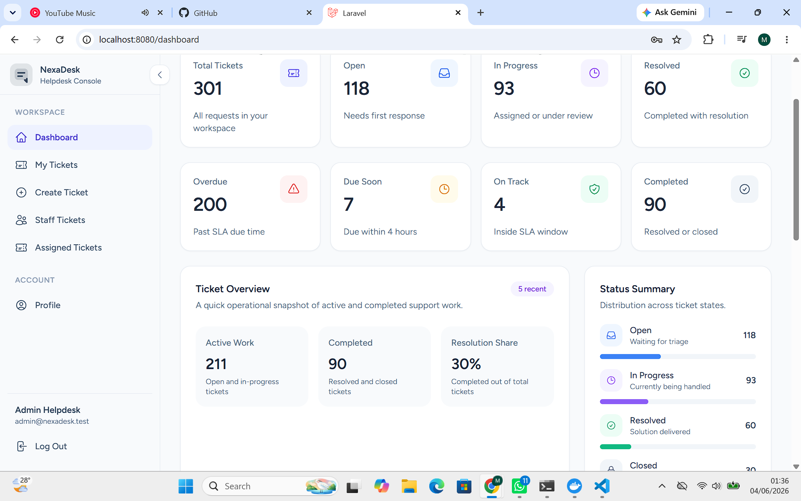
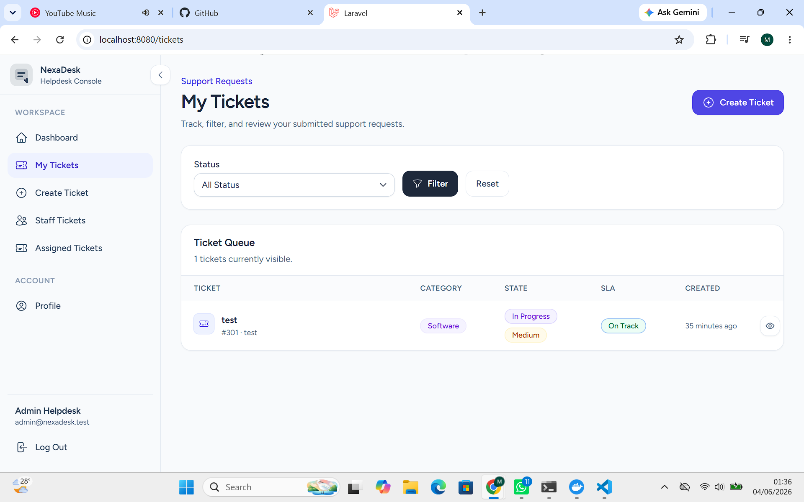
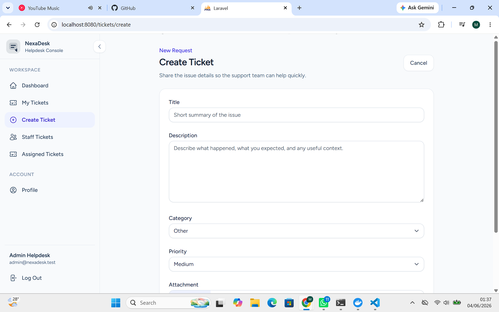
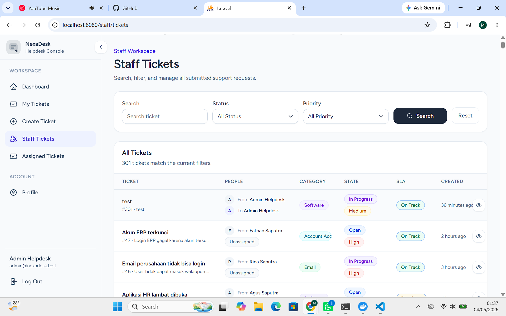
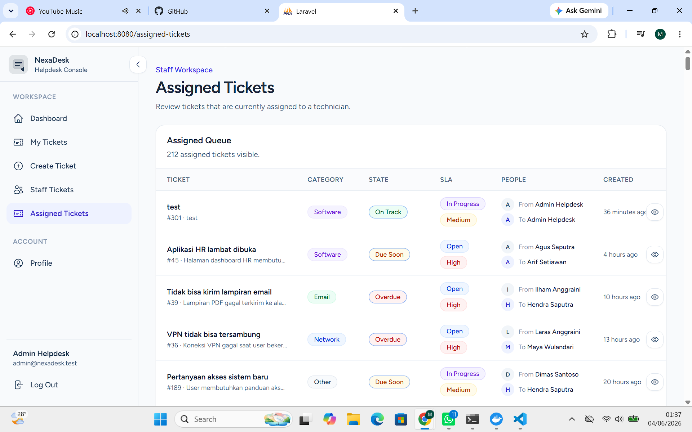
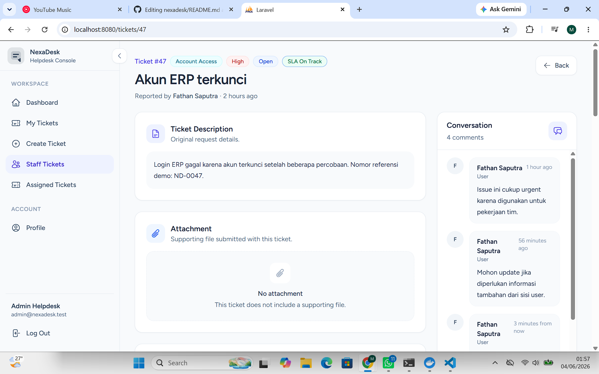

# NexaDesk



NexaDesk is a Helpdesk IT Ticketing System built with Laravel for a university final project / UAS. It provides a simple support workflow where users can submit IT issues, staff can manage incoming tickets, technicians can be assigned, and ticket progress can be tracked through statuses, comments, internal notes, and SLA indicators.

## Overview

This application uses Laravel Breeze authentication and a role-based access flow for three user types: regular users, technicians, and admins. Authenticated users can create and manage their own tickets, while staff users can view the wider ticket queue and handle operational support actions.

The project is implemented as a Blade-based Laravel application with Tailwind CSS styling, MySQL support through Laravel Sail, and database seeders for demo users and sample ticket data.

## Key Features

| Feature | Description |
| --- | --- |
| Authentication | User login, registration, email verification, and profile management |
| Ticket Management | Create, update, track, and manage support tickets |
| SLA Tracking | Automatic SLA deadline calculation based on ticket priority |
| Technician Assignment | Assign tickets to technicians for handling |
| Activity Timeline | Track ticket history and status changes |
| Internal Notes | Staff-only notes for troubleshooting and coordination |
| Dashboard Analytics | Ticket statistics and operational overview |

Additional implemented features include:

- Role-based access control using a custom `RoleMiddleware`.
- Ticket categories: Network, Hardware, Software, Email, Account Access, Printer, and Other.
- Ticket priorities: Low, Medium, and High.
- Ticket statuses: Open, In Progress, Resolved, and Closed.
- User ticket list with status filtering.
- Staff ticket list with search, status filtering, and priority filtering.
- Assigned ticket queue for staff users.
- Ticket detail page with metadata, attachment preview/download, SLA status, activity timeline, comments, and staff actions.
- Public ticket comments for communication between requesters and staff.
- Demo data seeding for admins, technicians, users, tickets, comments, internal notes, and ticket activities.

## Tech Stack

- Laravel 13
- PHP 8.3+
- Blade
- Tailwind CSS
- Alpine.js
- Vite
- MySQL 8.4 through Laravel Sail
- Laravel Breeze
- Laravel Sail
- Blade Heroicons
- phpMyAdmin service in `compose.yaml`

## User Roles

### User

Regular users can:

- Register and log in.
- View dashboard metrics scoped to their own tickets.
- Create tickets.
- View their own tickets.
- Filter their ticket list by status.
- View ticket details.
- Edit or delete their own tickets.
- Add comments to their own tickets.

### Technician

Technicians are staff users. They can:

- Access the staff ticket workspace.
- View all tickets from the staff ticket list.
- View assigned tickets.
- On the assigned ticket page, see tickets assigned to themselves.
- View ticket details.
- Add comments.
- Add staff-only internal notes.
- Update ticket status.
- Assign or reassign ticket technicians.

### Admin

Admins are staff users. They can:

- Access the same staff ticket management features as technicians.
- View all assigned tickets.
- Assign tickets to admins or technicians.
- Add internal notes and update ticket statuses.

## Ticket Workflow

1. A user logs in and creates a ticket from the Create Ticket page.
2. The user enters a title, description, category, priority, and optionally uploads a JPG, PNG, or PDF attachment up to 5 MB.
3. The system stores the ticket with `open` status and starts SLA tracking.
4. SLA due time is calculated from the selected priority:
   - High: 8 hours
   - Medium: 24 hours
   - Low: 72 hours
5. The ticket appears in the user's My Tickets page and in the staff ticket queue.
6. Staff users review tickets from the Staff Tickets page, where they can search by title and filter by status or priority.
7. Staff users can open a ticket detail page to:
   - Assign a technician.
   - Update the ticket status.
   - Add a public comment.
   - Add a staff-only internal note.
   - Review the activity timeline.
8. Users and staff can continue the conversation through ticket comments.
9. When staff changes the ticket status to `resolved` or `closed`, the SLA resolved timestamp is stored.
10. If a ticket is past its SLA due time during a status update, the SLA breach timestamp is recorded.

## Database Overview

The application uses the default Laravel authentication tables plus custom ticketing tables.

### users

| Column | Description |
| --- | --- |
| id | Primary key |
| name | User full name |
| email | User login email |
| password | Hashed user password |
| role | User access role: `user`, `technician`, or `admin` |
| email_verified_at | Email verification timestamp |
| timestamps | Laravel `created_at` and `updated_at` fields |

### tickets

| Column | Description |
| --- | --- |
| id | Primary key |
| user_id | Requester user ID linked to the user who created the ticket |
| assigned_to_user_id | Assigned staff user ID; nullable when no technician or admin is assigned |
| title | Short ticket title or issue summary |
| description | Detailed explanation of the reported issue |
| category | Ticket category: `network`, `hardware`, `software`, `email`, `account_access`, `printer`, or `other` |
| attachment_path | Optional uploaded attachment path for JPG, PNG, or PDF files |
| priority | Ticket priority: `low`, `medium`, or `high` |
| status | Ticket workflow status: `open`, `in_progress`, `resolved`, or `closed` |
| sla_started_at | Timestamp when SLA tracking starts |
| sla_due_at | Calculated SLA deadline based on ticket priority |
| sla_resolved_at | Timestamp when the ticket is marked resolved or closed |
| sla_breached_at | Timestamp recorded when the ticket passes its SLA deadline |
| timestamps | Laravel `created_at` and `updated_at` fields |

### ticket_comments

| Column | Description |
| --- | --- |
| id | Primary key |
| ticket_id | Related ticket ID |
| user_id | User ID of the comment author |
| message | Public comment message shown in the ticket conversation |
| timestamps | Laravel `created_at` and `updated_at` fields |

### ticket_activities

| Column | Description |
| --- | --- |
| id | Primary key |
| ticket_id | Related ticket ID |
| user_id | User ID linked to the activity; nullable for system-level activity |
| type | Activity type, such as ticket creation, comment, assignment, or status change |
| description | Human-readable activity description shown in the activity timeline |
| timestamps | Laravel `created_at` and `updated_at` fields |

### ticket_internal_notes

| Column | Description |
| --- | --- |
| id | Primary key |
| ticket_id | Related ticket ID |
| user_id | Staff user ID of the internal note author |
| body | Private staff-only note content for troubleshooting or coordination |
| timestamps | Laravel `created_at` and `updated_at` fields |

## Installation Guide Using Laravel Sail

### Prerequisites

- Docker Desktop
- Composer
- Node.js and npm

### Setup Steps

Clone the repository:

```bash
git clone <repository-url>
cd nexadesk
```

Install PHP dependencies:

```bash
composer install
```

Copy the environment file:

```bash
cp .env.example .env
```

Start Laravel Sail:

```bash
./vendor/bin/sail up -d
```

Generate the application key:

```bash
./vendor/bin/sail artisan key:generate
```

Configure the database in `.env` for the MySQL service from `compose.yaml`:

```env
DB_CONNECTION=mysql
DB_HOST=mysql
DB_PORT=3306
DB_DATABASE=laravel
DB_USERNAME=sail
DB_PASSWORD=password
```

Run migrations and seed the database:

```bash
./vendor/bin/sail artisan migrate --seed
```

Install frontend dependencies:

```bash
./vendor/bin/sail npm install
```

Run the Vite development server:

```bash
./vendor/bin/sail npm run dev
```

Open the application:

```text
http://localhost
```

Open phpMyAdmin:

```text
http://localhost:8081
```

## Demo Accounts

| Role | Email | Password |
| --- | --- | --- |
| Admin | [admin@nexadesk.test](mailto:admin@nexadesk.test) | password |
| Technician | [technician1@nexadesk.test](mailto:technician1@nexadesk.test) | password |
| User | [user1@nexadesk.test](mailto:user1@nexadesk.test) | password |

Additional demo technician accounts are available from [technician1@nexadesk.test](mailto:technician1@nexadesk.test) to [technician10@nexadesk.test](mailto:technician10@nexadesk.test).

Additional demo user accounts are available from [user1@nexadesk.test](mailto:user1@nexadesk.test) to [user100@nexadesk.test](mailto:user100@nexadesk.test).

All demo accounts use the password: `password`.

## Screenshots

| Dashboard | My Tickets |
| --- | --- |
|  |  |

| Create Ticket | Staff Tickets |
| --- | --- |
|  |  |

| Assigned Tickets |
| --- |
|  |

### Ticket Detail

The ticket detail page shows ticket metadata, SLA status, staff actions, internal notes, comments, and the activity timeline.



## Future Improvements

Potential improvements for future development:

- Admin-only user management page.
- Ticket category management from the UI.
- Email notifications for ticket creation, assignment, comments, and status changes.
- Dedicated SLA policy configuration screen.
- Pagination for large ticket lists.
- More advanced reporting and analytics.
- Export tickets to CSV or PDF.
- Automated feature tests for ticket workflows and role access.

## Author

| Field | Information |
| --- | --- |
| Name | Muhammad Fathan |
| GitHub | [github.com/fathxvn](https://github.com/fathxvn) |
